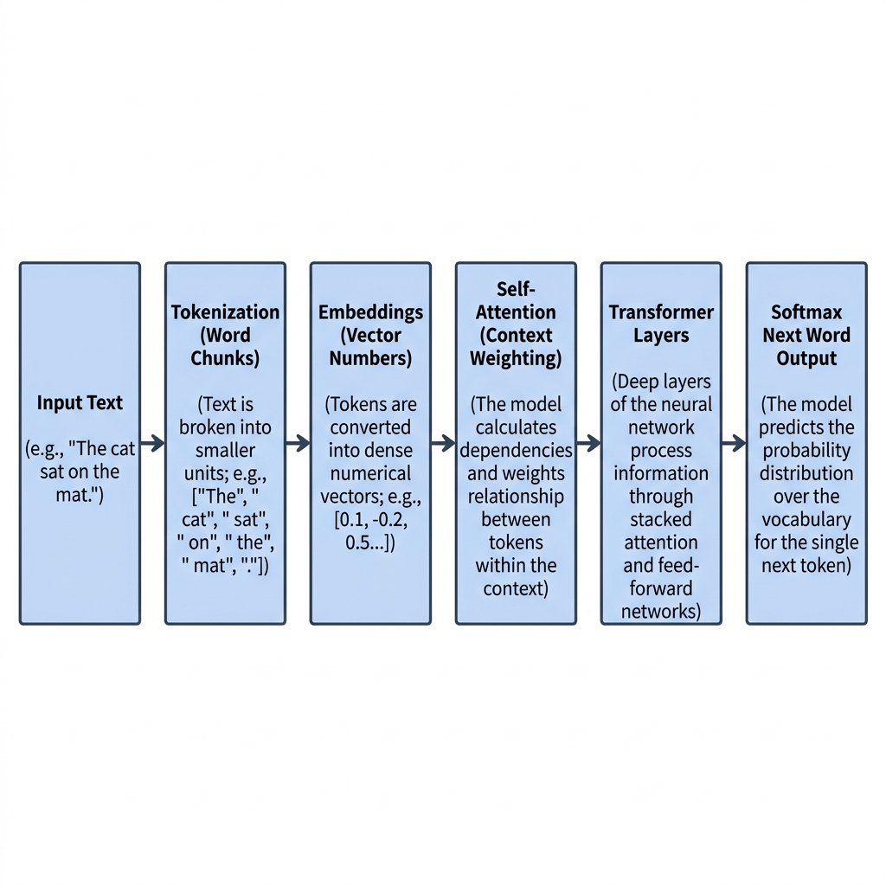

# Topic 2: How LLMs Actually Work — Tokens, Embeddings, Attention & Transformers

> Part of the **Forward Deployed Engineering (FDE) Mastery Repo** — a one-stop learning path for becoming a Forward Deployed Engineer. This is Topic 2, building directly on Topic 1 (The Evolution of AI & the Role of an FDE).

---

## Table of Contents

1. [The Core Principle of LLMs: Next Word Prediction](#1-the-core-principle-of-llms-next-word-prediction)
2. [Tokenization: How AI Reads Language](#2-tokenization-how-ai-reads-language)
3. [Vector Embeddings: Giving Words Meaning](#3-vector-embeddings-giving-words-meaning)
4. [The Self-Attention Mechanism (QKV)](#4-the-self-attention-mechanism-qkv)
5. [Transformers: Layering the Context](#5-transformers-layering-the-context)
6. [Softmax, Sampling, and Temperature](#6-softmax-sampling-and-temperature)
7. [Putting It All Together: The Full Pipeline](#7-putting-it-all-together-the-full-pipeline)
8. [2026 Industry Update: What's Changed Since the Original Transformer](#8-2026-industry-update-whats-changed-since-the-original-transformer)
9. [Interview Questions & Answers](#9-interview-questions--answers)

---

## 1. The Core Principle of LLMs: Next Word Prediction

At its absolute core, an LLM has one job: **given some text, predict the single most likely next word (technically "token") to come next.** That's it. Every seemingly "intelligent" thing an LLM does — writing essays, answering questions, generating code — is this same basic operation, repeated over and over, one token at a time, with each new token added back into the input for the next prediction.

### Context Narrows the Prediction

The more context you provide, the more the space of "plausible next words" shrinks, and the more accurate/specific the prediction becomes.

**Real-World Example:** Consider the sentence **"I drink coffee every..."** — the next word could reasonably be "morning," "day," "afternoon," "single day," etc. There are many plausible options. Now consider: **"I am a remote software engineer, and I drink coffee every morning before going to my..."** — with all that added context, the model can much more confidently predict "desk" or "home office," because the surrounding details (remote worker, morning routine) have sharply narrowed the realistic possibilities. This is exactly why more context (a well-written prompt, relevant background info) leads to better, more precise LLM outputs — it's mathematically shrinking the space of reasonable next-word guesses.

---

## 2. Tokenization: How AI Reads Language

### Computers Don't Understand Letters — They Understand Numbers

A neural network is fundamentally a giant mathematical function. It cannot operate on raw characters like "c", "a", "t" — it can only operate on **numbers**. So before any text reaches the model, it must first be converted into numerical IDs. This conversion process is called **Tokenization**.

### What Is a Tokenizer?

A **Tokenizer** is the component that breaks raw text into smaller chunks called **tokens**, and maps each chunk to a unique numerical ID (a **Token ID**) from a fixed vocabulary the model was trained with.

**Real-World Example:** The word "unbelievable" might not exist as a single token in the model's vocabulary. Instead, the tokenizer might break it into sub-word chunks like `["un", "believ", "able"]`, each with its own Token ID. This is very similar to how a search engine autocomplete breaks your typing into recognizable fragments to predict what you're typing next — the model is working with reusable "building blocks," not whole words.

### Why Sub-Word Tokens? The Core Trade-off

There are three ways you *could* design a tokenizer, and each has a problem:

- **Character-level tokens** (one token per letter): Vocabulary stays tiny, but every sentence turns into a huge number of tokens, making processing slow and expensive, and making it harder for the model to capture meaning (since individual letters carry almost no semantic content).
- **Word-level tokens** (one token per whole word): Fewer tokens per sentence, but the vocabulary becomes impractically massive — you'd need a unique token for every word, every tense, every plural, every misspelling, in every language. New or rare words ("uncharacteristically," a brand name, a typo) would have no token at all.
- **Sub-word tokens** (the actual solution used by GPT, Claude, and most modern LLMs): Common whole words get their own single token (e.g., "the," "dog"), while rarer or complex words get broken into smaller reusable chunks (e.g., "un" + "believ" + "able"). This keeps the vocabulary a manageable size (tens of thousands of tokens) while still being able to represent *any* word — even ones never seen during training — by combining sub-word pieces.

**Real-World Example:** Think of sub-word tokenization like Lego bricks instead of pre-built statues. Instead of needing a unique, pre-molded Lego piece for every possible object in the universe (impossible), you have a manageable set of standard bricks ("un," "believ," "able," "ing," "tion") that can be combined to build almost any word, including ones the model has never explicitly seen before.

### Tokenizers Differ Across Models

Different LLMs use different tokenizers, trained on different data with different vocabulary sizes and splitting rules. This means the **exact same sentence** can be broken into a different number of tokens, and different token boundaries, depending on which model you're using.

**Real-World Example:** The same input sentence might get tokenized into, say, 42 tokens by a GPT-3 style tokenizer, but only 37 tokens by a GPT-4 style tokenizer (which uses a more efficient vocabulary), and a still-different count by Claude's tokenizer. This matters practically because API pricing and context-window limits are almost always measured in tokens, not words or characters — so the "same" prompt can literally cost a different amount, or fit differently into a context window, depending on which model's tokenizer is processing it.

---

## 3. Vector Embeddings: Giving Words Meaning

### From Token ID to Meaning

A Token ID (like `4207`) is just an arbitrary index — it carries no meaning on its own. The next step is converting each token into an **embedding**: a **vector** (a list/array of numbers) that represents the word's meaning across many hidden, learned dimensions.

**Real-World Example:** Imagine rating every word in the dictionary on a set of invisible sliders — "How royal is this word?", "How related to food is this word?", "How related to technology is this word?", and thousands of other dimensions nobody explicitly named. The model learns these ratings automatically from data during training. Each word ends up as a long list of numbers (its vector), for example:

| Word | "Royalty" score | "Food" score | "Technology" score |
| --- | --- | --- | --- |
| King | 0.91 | 0.02 | 0.01 |
| Queen | 0.89 | 0.01 | 0.01 |
| Banana | 0.01 | 0.95 | 0.00 |
| Laptop | 0.00 | 0.01 | 0.97 |

(In reality these vectors have hundreds or thousands of dimensions, and the dimensions themselves aren't human-labeled like "royalty" — this table is a simplified illustration of the *idea*.)

### Why This Matters: Words Live in "Meaning Space"

Because every word becomes a point in this high-dimensional numerical space, the model can measure **mathematical distance and similarity** between words. Words with similar meanings end up with similar vectors (close together in this space), while unrelated words end up far apart.

**Real-World Example:** In the table above, "King" and "Queen" have very similar Royalty/Food/Technology scores — mathematically close together — while "Banana" and "Laptop" are far away from both "King" and each other on the relevant dimensions. The model has never been told what a "king" *is* in the human sense — it has simply learned, from massive amounts of text, that "King" and "Queen" tend to appear in similar contexts, and encoded that pattern numerically. This is also the famous basis for vector arithmetic like `King − Man + Woman ≈ Queen` — relationships between concepts become literal, measurable math.

---

## 4. The Self-Attention Mechanism (QKV)

### The Flaw of Processing Words in Isolation

A raw embedding for a word is **static** — the word "bank" gets the same starting vector whether it appears in "I sat by the river **bank**" or "I deposited cash at the **bank**." But the actual *meaning* of "bank" is completely different in each sentence. The model needs a way to let each word's meaning be **reshaped by its surrounding context**. That mechanism is called **Self-Attention**.

**Real-World Example:** "The trophy didn't fit in the suitcase because it was too big" vs. "The **bank** approved my loan" and "I walked along the river **bank**" — in every case, the *same starting word* needs to end up meaning something different depending on its neighbors. Self-Attention is the mechanism that makes this possible.

### The QKV Model — Explained Like a Google Search

The clearest analogy for Self-Attention is a search engine. When you type a query into Google, here's roughly what happens:

- **Query (Q):** This is *what you're searching for* — the question in your head.
- **Key (K):** Every webpage on the internet has a set of keywords/tags describing *what information it offers* — this is how the search engine decides if a page is relevant to your query.
- **Value (V):** Once a page is deemed relevant, the actual **content** of that page is what you actually read and use.

Self-Attention applies this exact same idea to every single token in a sentence:

- Every token generates its own **Query** vector: "What context am I looking for to understand myself better?"
- Every token also generates a **Key** vector: "Here's the kind of information I have to offer to other tokens."
- Every token also generates a **Value** vector: "Here's the actual content/information I contribute if someone finds me relevant."

**Real-World Example:** Take the sentence "I deposited cash at the bank." The token "bank" generates a Query effectively asking, "What kind of place am I?" It then compares that Query against the Key of every other word in the sentence — "deposited" and "cash" produce Keys that are highly relevant to a financial-institution meaning of "bank," so they get a **high Relevance Score**. "I" and "at" produce Keys that are much less relevant, so they get **low Relevance Scores**.

### From Relevance Scores to a Context-Aware Vector

Once the model has a Relevance Score between "bank" and every other word in the sentence, it uses those scores as **weights** to blend together the **Values** of all the other words. Highly relevant words (like "deposited" and "cash") contribute a lot to the final blended vector; irrelevant words contribute very little. The result is a brand-new vector for "bank" that now encodes "this is the financial-institution sense of the word" — a **context-aware version** of the original static embedding.

**Real-World Example:** It's like a group project where "bank" asks every other word in the sentence, "How relevant are you to helping me figure out what I actually mean here?" — "deposited" and "cash" raise their hands enthusiastically (high relevance) and contribute a lot of their "value" (financial-context information) to the final answer, while "I" and "at" barely contribute anything. The final combined result is "bank," but now specifically shaped to mean *the financial kind*.

---

## 5. Transformers: Layering the Context

### Attention Is One Piece of a Bigger Machine

Self-Attention is the star of the show, but it's only **one component** inside a larger structure called a **Transformer block**. Each Transformer block combines a Self-Attention step with additional processing (like a small neural network layer applied to each token) that further refines the representation. Modern LLMs stack **many** of these Transformer blocks — sometimes dozens or even over a hundred — one after another.

### Why Stack Multiple Layers?

Each layer refines the understanding a bit further, building from simple patterns toward highly abstract, long-range contextual understanding:

- **Early layers** tend to pick up on relatively simple, local relationships — e.g., matching a noun to its nearby verb, or recognizing basic grammatical structure.
- **Deeper layers** combine and build on everything the earlier layers found, enabling the model to resolve much more complex, long-distance relationships — e.g., figuring out exactly who "his" refers to several sentences earlier in a long paragraph.

**Real-World Example:** Think of it like editing an essay through multiple rounds of review. The first editor (early layer) just fixes basic grammar and checks that subjects and verbs agree. A second editor (a middle layer) checks that sentences flow logically together. A third, most senior editor (a deep layer) reads the *entire* document and catches something like, "Wait — in paragraph 5, 'his' is ambiguous; based on everything established in paragraphs 1 through 4, it must refer to the CEO, not the intern." Each pass adds a more sophisticated layer of understanding on top of the last.

### The Final Step: From Understanding to a Prediction

After the text has passed through every Transformer layer, the model has an extremely rich, deeply contextual vector representing "everything relevant to predicting the next token, given everything that came before." The final layer takes this vector and compares it against **every single token in the model's entire vocabulary**, producing a raw numerical score for each one — these raw scores are called **Logits**.

**Real-World Example:** Imagine the model has built up a rich contextual understanding of the sentence "The capital of France is," and now needs to score every possible next word in its \~100,000-token vocabulary. It might assign "Paris" a very high Logit score, "London" a low-but-nonzero score (it's still a plausible capital city in general), and "banana" an extremely low score (almost no relevance in this context) — these raw, unnormalized scores are exactly what gets passed to the next stage.

---

## 6. Softmax, Sampling, and Temperature

### Softmax: Turning Logits into Probabilities

Logits are just raw scores — they can be any positive or negative number and don't mean much on their own. **Softmax** is a mathematical function that converts this raw list of Logits into a clean **probability distribution**: a set of numbers, one per possible next token, that are all positive and sum to exactly 100%.

**Real-World Example:** After Softmax, the earlier "capital of France" example might turn into something like: Paris = 87%, London = 4%, Rome = 3%, Madrid = 2%, and thousands of other tokens splitting the remaining tiny sliver of probability. Now the numbers are directly interpretable — "the model is 87% confident the next word should be 'Paris.'"

### Greedy Decoding vs. Sampling

Once you have a probability distribution, you still need to decide **which token to actually pick**.

- **Greedy Approach:** Always pick the single highest-probability token, every single time. This sounds ideal, but in practice it makes the model's output feel **robotic, repetitive, and boring** — it removes all natural variation, and can even get the model stuck in repetitive loops.
- **Sampling:** Instead of always taking the #1 option, the model treats the probability distribution like a **weighted lottery** — higher-probability words are more *likely* to be picked, but lower-probability words still get a real chance. This introduces natural variation and makes outputs feel more human and less mechanically predictable.

**Real-World Example:** Greedy decoding is like a person who, when asked "How was your day?", always answers with the literal statistically most common response — "Good, thanks" — every single time, verbatim, no matter what actually happened. Sampling is like a real person who usually says something in that general neighborhood ("pretty good," "not bad," "kind of long but good") but with natural variety, occasionally saying something less common and more colorful, without ever picking something wildly irrelevant.

### Temperature: Controlling the Randomness

**Temperature** is a parameter that reshapes the probability distribution *before* sampling happens, controlling how "safe" or "adventurous" the model's word choices are.

- **Low Temperature (\< 1):** Sharpens the distribution — it makes the already-high-probability words even *more* dominant, and pushes low-probability words even closer to zero. This makes the model's output more strict, focused, and predictable (useful for factual tasks, code generation, or anything requiring precision).
- **High Temperature (> 1):** Flattens the distribution — it pulls the probabilities of different tokens closer together, giving lower-probability (more surprising/creative) words a meaningfully better chance of being picked. This makes the model's output more varied, creative, and occasionally unexpected (useful for brainstorming, creative writing, or generating diverse options).

**Real-World Example:** Picture the "capital of France" distribution again (Paris 87%, London 4%, Rome 3%, Madrid 2%, ...). At **low temperature**, that gets sharpened to something like Paris 98%, London 1%, Rome 0.5% — the model becomes extremely likely to always say "Paris." At **high temperature**, it gets flattened toward something like Paris 40%, London 20%, Rome 15%, Madrid 10% — suddenly there's a real, meaningful chance the model says something other than "Paris," which is great for creative brainstorming but risky for a task where you need a strictly correct factual answer.

---

## 7. Putting It All Together: The Full Pipeline

Here's the entire journey from raw text input to a generated response, end to end:

1. **Input text** is broken into **tokens** by the tokenizer, and each token is mapped to a numerical **Token ID**.
2. Each Token ID is converted into a static **vector embedding** representing its general meaning.
3. These embeddings pass through many stacked **Transformer layers**, where **Self-Attention (QKV)** repeatedly reshapes each word's vector based on its surrounding context — early layers catching simple patterns, deeper layers catching complex, long-range relationships.
4. The final layer compares the fully contextualized representation against the entire vocabulary to produce raw **Logits** — a score for every possible next token.
5. **Softmax** converts those raw Logits into a clean **probability distribution** across the whole vocabulary.
6. **Temperature** reshapes that distribution to be more strict or more creative, and then **Sampling** (or Greedy decoding) picks the actual next token.
7. That newly generated token gets **appended to the input**, and the entire process repeats — one token at a time — until the model produces a complete response.

**Real-World Example:** This is exactly why, when you watch a model like ChatGPT or Claude generate a response, you often see the text stream out word by word (or even sub-word by sub-word) rather than appearing all at once — the model is literally re-running this entire seven-step pipeline for every single new token it produces.

---

## 8. 2026 Industry Update: What's Changed Since the Original Transformer

The core mechanics above (tokenization, embeddings, QKV attention, stacked transformer layers, softmax/sampling/temperature) are still exactly how every frontier LLM works today. But the field has kept innovating on top of that foundation. Here's what's actually new in production and research as of 2026, so you're not just learning 2017-era theory.

### Attention Is Getting Cheaper to Cache: Multi-Head Latent Attention (MLA)

The biggest practical bottleneck in serving LLMs isn't the model's weights — it's the **KV cache**: the stored Key and Value vectors for every token in a conversation, which the model needs to keep around so it doesn't have to recompute attention from scratch on every new token. Standard multi-head attention stores separate key and value vectors for each head, and this cache grows linearly with sequence length and number of heads.

**Multi-Head Latent Attention (MLA)**, pioneered by DeepSeek, tackles this directly: instead of keeping full key and value tensors for every token, the model projects them into a compact latent space and reconstructs what it needs when computing attention, which reduces cache size and memory bandwidth pressure at decode time. This can reduce KV cache memory by roughly 93% compared to standard multi-head attention — which is a large part of why some 2026-era models can serve very long conversations at a fraction of the cost that would have been required with the original 2017 Transformer design.

**Real-World Example:** Think of the original approach as photocopying and keeping every single page of a reference book on your desk so you can flip back to any page instantly — it works, but your desk fills up fast. MLA is like keeping a compact, compressed index of the book instead, and quickly "unzipping" just the part you need, on demand — you get almost the same speed with a fraction of the desk space.

### Sparse & Efficient Attention

Beyond MLA, a broader body of 2026 research focuses on **sparse attention**: rather than every token attending to every other token (which gets expensive as conversations get longer), sparse attention techniques limit attention computation to selected subsets of tokens based on fixed patterns, block-wise routing, or clustering strategies, improving efficiency while preserving contextual coverage. This is one of the main reasons context windows have been able to grow so dramatically — long-context models are now processing sequence lengths exceeding 1 million tokens, something that would have been computationally impractical with naive full attention.

### Tokenization Is Still Evolving Too

Sub-word tokenization (the approach this guide teaches) remains the production default, but 2026 research is actively chipping away at its rough edges:

- **LiteToken (2026):** identifies and removes "intermediate merge residues" — tokens that were frequent during the tokenizer's training process but rarely actually appear in final tokenized output — and works as a plug-and-play upgrade to any existing tokenizer, reducing fragmentation and improving handling of noisy or misspelled input.
- **Tokenizer-free / byte-level models:** Some research models now skip traditional tokenization entirely. T-FREE uses sparse hashed character-trigram embeddings instead of a learned vocabulary, letting the model handle any text input without a fixed vocabulary at all, while MambaByte shows that certain architectures can scale to raw byte-level input without the quadratic attention cost that historically forced tokenization onto transformers. As of 2026 these byte-level approaches are not yet the production default, but are no longer a fringe idea.
- **Tokenizer choice has real cost implications:** the same prompt can tokenize at meaningfully different rates depending on language and vocabulary — for example, certain languages can tokenize at 1.6x the per-character cost of English under an older vocabulary, and switching to a more efficient tokenizer can cut per-character token cost on those languages by around 35% with no change to the prompt or model itself. This reinforces the Section 2 point that tokenizer choice directly drives API cost and context-window usage in production systems.

### A Wrinkle in the "Feed-Forward" Half of the Transformer

This guide focused on Attention, but each Transformer block also contains a feed-forward network applied to every token after attention runs. Despite their architectural simplicity, these feed-forward layers actually contain roughly two-thirds of a transformer's total parameters — a useful correction to the common assumption that Attention is where "most of the model" lives. SwiGLU activation has become the dominant choice in frontier models in 2026 for its training stability and empirical performance in this feed-forward component.

**Sources for this update:** DeepSeek-V2/V3 Multi-Head Latent Attention documentation and analysis (memx.app, generalcompute.com, theorempath.com); "Efficient Attention Mechanisms for Large Language Models: A Survey," arXiv 2507.19595; "How LLM Tokenization Actually Works Under the Hood," Let's Data Science (Feb 2026); "What is Tokenization in LLMs? BPE, SentencePiece, tiktoken in 2026," FutureAGI; "Inside the Machine: A Complete Technical Guide to How LLMs Actually Generate Tokens in 2026," Medium/NJ Raman.

### What This Means Practically for an FDE

None of this changes the fundamentals you just learned — every model discussed above still tokenizes text, builds embeddings, uses some form of Query/Key/Value attention, stacks layers, and samples from a probability distribution. What's changed is **efficiency and scale**: longer context windows, cheaper serving costs, and more robust handling of messy real-world text (typos, rare words, multiple languages). As an FDE, the practical takeaway is that model/tokenizer choice is not a purely academic decision — it has direct, measurable effects on a client's latency, API cost, and multilingual reliability, and it's worth periodically checking what's changed, since this is one of the fastest-moving parts of the stack.

---

## 9. Interview Questions & Answers

### Conceptual / Foundational

**1. What is the fundamental task an LLM is actually performing at each generation step?** At every step, an LLM is predicting the single most probable next token, given all the tokens that came before it. Everything the model appears to "do" — reasoning, writing, coding — emerges from repeating this one operation token by token.

**2. Why can't a neural network process raw text characters directly?** A neural network is a mathematical function that only operates on numbers. Raw text has no inherent numerical structure, so it must first be converted into numerical Token IDs (via tokenization) before any computation can happen.

**3. What is a tokenizer, and why don't LLMs use one token per character?** A tokenizer breaks text into chunks (tokens) and maps each to a numerical ID from a fixed vocabulary. Using one token per character would keep the vocabulary tiny but make every sentence extremely long to process and would carry very little meaning per token, so models instead use sub-word tokenization, which balances vocabulary size against sequence length.

**4. Why don't LLMs simply use one token per whole word either?** A whole-word vocabulary would need a unique entry for every word, tense, plural, and misspelling in every language, making the vocabulary impractically large and unable to handle new or rare words. Sub-word tokenization solves this by breaking rare/complex words into smaller, reusable chunks that can recombine to represent virtually any word.

**5. Why can the exact same sentence produce a different number of tokens across different models like GPT and Claude?** Different models are trained with different tokenizers, each with its own vocabulary and splitting rules, so the same input text gets segmented differently depending on which model's tokenizer processes it. This directly affects things like API cost and how much text fits in a given context window.

**6. What is a vector embedding, and what problem does it solve?** A vector embedding is a list of numbers representing a token's meaning across many learned dimensions. It solves the problem that a raw Token ID is just an arbitrary index with no inherent meaning — embeddings give the model a mathematical representation of semantic relationships between words.

**7. Why do "King" and "Queen" end up with similar embedding vectors while "Banana" ends up far away from both?** The model learns embeddings purely from patterns in massive amounts of training text — words that tend to appear in similar contexts end up with similar vectors. "King" and "Queen" appear in overlapping contexts far more often than either does with "Banana," so their learned vectors end up numerically close together.

### Applied / Mechanism-Based

**8. What problem does Self-Attention solve that static embeddings alone cannot?** Static embeddings give a word the same vector no matter where it appears, but a word's actual meaning can change dramatically based on context (e.g., "bank" of a river vs. a financial bank). Self-Attention reshapes each word's vector based on its surrounding words, producing a context-aware representation.

**9. Explain Query, Key, and Value in your own words, using the Google Search analogy.** The Query is what a token is "searching for" to understand its own context, similar to a search query you type in. The Key is what each other token has to "offer" as a match, similar to the keywords/tags describing a webpage. The Value is the actual content contributed once a token is deemed relevant, similar to the actual content of a search result you read.

**10. How does the model decide how much one word should influence another word's meaning?** It compares the Query vector of one token against the Key vector of every other token in the sequence to compute a Relevance (Attention) Score for each pair. Those scores are then used as weights to blend together the Value vectors of all the other tokens into a new, context-aware vector for the original token.

**11. Why do LLMs stack many Transformer layers instead of using just one?** A single layer can only capture relatively simple, local relationships, like matching a noun to a nearby verb. Stacking many layers lets the model progressively build up from simple patterns in early layers to highly complex, long-range contextual relationships (like resolving what a pronoun refers to several sentences earlier) in deeper layers.

**12. What are Logits, and where do they come from?** Logits are the raw, unnormalized scores the model's final layer assigns to every token in its vocabulary, representing how strongly each one is supported as the next token, based on the fully contextualized representation built up through all the Transformer layers.

**13. What does Softmax do, and why is it necessary?** Softmax converts the raw Logit scores into a clean probability distribution — a set of values that are all positive and sum to 100%. It's necessary because raw Logits aren't directly interpretable as probabilities, while a Softmax output is (e.g., "87% confident the next word is 'Paris'").

**14. What's the practical difference between Greedy decoding and Sampling, and what problem does Greedy decoding cause?** Greedy decoding always picks the single highest-probability token every time, which tends to make output feel robotic, repetitive, and prone to getting stuck in loops. Sampling instead treats the probability distribution like a weighted lottery, giving lower-probability tokens a real (if smaller) chance of being chosen, producing more natural, varied output.

**15. How does adjusting Temperature change the model's behavior, mathematically and practically?** Mathematically, low temperature sharpens the probability distribution (making high-probability tokens even more dominant), while high temperature flattens it (giving lower-probability tokens a meaningfully better chance). Practically, low temperature produces strict, predictable, factual-leaning output, while high temperature produces more varied, creative, and occasionally surprising output.

### FDE / Applied Engineering Scenarios

**16. A client complains that their factual Q&A bot occasionally gives inconsistent or "creative" answers to the same question. What parameter would you check first, and why?** I'd check the Temperature setting first — a factual Q&A use case should typically run at a low temperature so the model reliably favors its highest-confidence answer rather than sampling more varied, lower-probability alternatives.

**17. A client wants a creative brainstorming tool that generates diverse marketing taglines. Would you recommend low or high temperature, and why?** I'd recommend a higher temperature, since flattening the probability distribution gives lower-probability, more unusual word choices a real chance of being selected, which produces more varied and creative output — exactly what a brainstorming tool needs, as opposed to a factual tool that should stay predictable.

**18. Why might token count matter directly to a client's API costs and context-window limits, and how would you explain that to a non-technical stakeholder?** Most LLM providers charge and measure limits per token, not per word or character, and different models tokenize the same text differently. I'd explain it to a stakeholder as: "the length of a prompt isn't measured in words like we normally think — it's measured in these smaller chunks called tokens, and that chunking varies by which model we use, which directly affects both cost and how much text we can fit in a single request."

**19. Why is it technically inaccurate to say an LLM "understands" a word the way a human does, based on what you now know about embeddings and attention?** The model has no human-style conceptual understanding — it only has a learned numerical vector shaped by statistical patterns in training data, further reshaped by attention based on surrounding context. It's mathematically modeling relationships between words based on co-occurrence patterns, not grounding words in real-world experience the way a human does.

**20. How would you explain, in simple terms to a non-technical client, why an LLM sometimes "hallucinates" — connecting it back to how next-token prediction actually works?** I'd explain that the model isn't looking up facts from a database — at every step it's just predicting the statistically most plausible next word based on patterns learned during training. If the model wasn't given the actual, current, correct information as context, it can still generate a fluent, confident-sounding sentence that happens to be factually wrong, because fluency and factual correctness are not the same thing to the underlying prediction mechanism.
