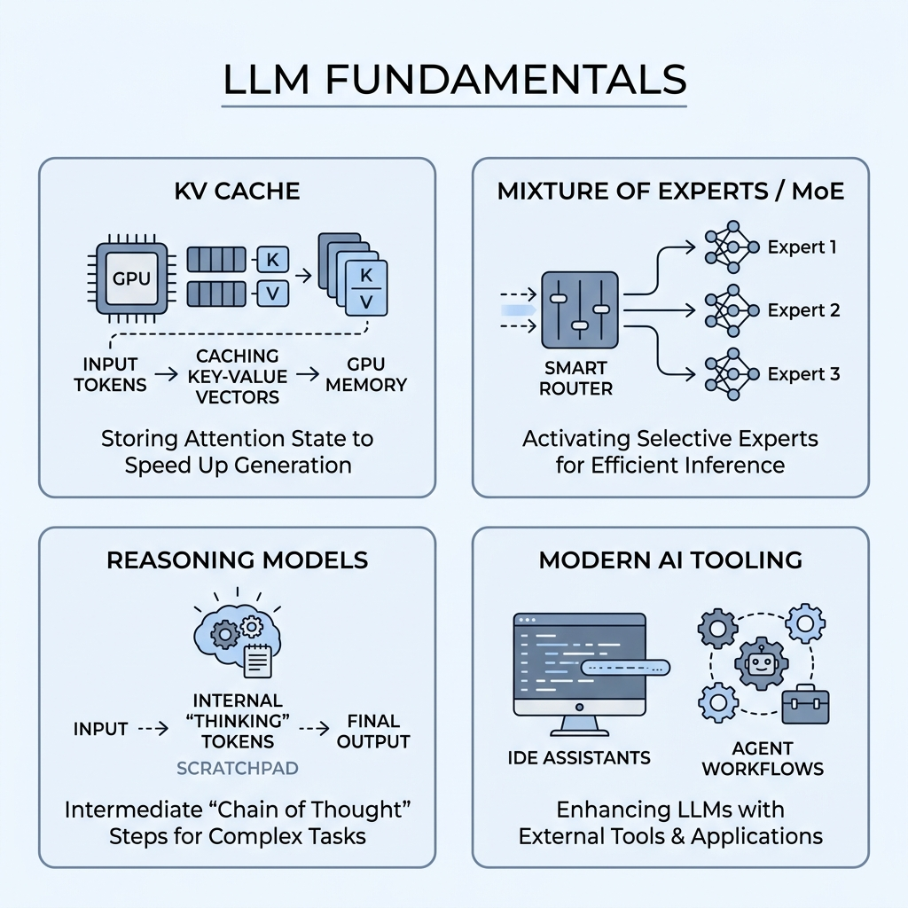

# Topic 4: LLM Fundamentals — KV Cache, Mixture of Experts, Reasoning Models & The Modern AI Tool Landscape

> Part of the **Forward Deployed Engineering (FDE) Mastery Repo** — a one-stop learning path for becoming a Forward Deployed Engineer. This is Topic 4, the first topic of **Module 1: LLM Engineering & Model Integration**. It builds directly on Topic 2 (How LLMs Actually Work: Tokens, Embeddings, Attention, Transformers) — if you haven't read that one, start there, since this guide assumes you already understand tokenization, embeddings, and the QKV self-attention mechanism.

---

## Table of Contents

1. [Recap: Why This Topic Exists](#1-recap-why-this-topic-exists)
2. [KV Cache: Why LLMs Don't Re-Read Everything on Every Word](#2-kv-cache-why-llms-dont-re-read-everything-on-every-word)
3. [Mixture of Experts (MoE): Bigger Models Without the Full Cost](#3-mixture-of-experts-moe-bigger-models-without-the-full-cost)
4. [Reasoning Models: "Thinking" Tokens and When to Use Them](#4-reasoning-models-thinking-tokens-and-when-to-use-them)
5. [ChatGPT, Claude, Copilot, Cursor: Strengths & When to Use Each](#5-chatgpt-claude-copilot-cursor-strengths--when-to-use-each)
6. [No-Code AI Tools: Prototyping Fast for Client Demos](#6-no-code-ai-tools-prototyping-fast-for-client-demos)
7. [Interview Questions & Answers](#7-interview-questions--answers)

---

## 1. Recap: Why This Topic Exists

Topic 2 explained how a Transformer processes text: tokens become embeddings, Self-Attention (QKV) reshapes each word's meaning based on context, and this repeats across many stacked layers before the model predicts the next token. That explanation was **architecturally accurate but operationally incomplete** — it didn't explain two things that matter enormously in production: **why serving a long conversation doesn't get catastrophically slower with every new message (KV Cache)**, and **why some frontier models can have trillions of parameters without costing trillions of parameters' worth of compute on every request (Mixture of Experts)**. This topic fills in both gaps, then moves into a closely related, very practical set of concepts: reasoning models, and the current landscape of AI tools an FDE actually touches day to day.

---

## 2. KV Cache: Why LLMs Don't Re-Read Everything on Every Word

### The Problem: Attention Is Expensive, and It Repeats Itself

Recall from Topic 2 that Self-Attention works by comparing a token's **Query** against the **Key** of every other token in the sequence, then blending together their **Values**. Here's the catch: when an LLM generates a response one token at a time, **every single new token requires re-running attention against every token that came before it** — including the entire prompt and everything the model has generated so far. Without any optimization, generating a long response would mean recomputing the Key and Value vectors for the *entire* conversation, from scratch, at every single step — an enormous amount of wasted, repeated work.

### The Fix: Cache What Doesn't Change

The **KV Cache** solves this by storing the Key and Value vectors for every token **the moment they're first computed**, so they never have to be recalculated. When the model generates the next token, it only computes a fresh Query for that new token and fresh Key/Value vectors for that one new token — then it simply **looks up** all the previously computed Keys and Values from the cache instead of recomputing them.

**Real-World Example:** Imagine you're a librarian answering a long series of follow-up questions about a huge reference book. Instead of re-reading the entire book from page one every single time someone asks a new question (wildly inefficient), you keep a running set of sticky notes on every page you've already read, summarizing what's there. For each new question, you only need to read the *new* page that's relevant, and quickly reference your existing sticky notes for everything else — dramatically faster than starting over each time. That's exactly what the KV Cache does: it's the model's "sticky notes" for every token it has already processed.

### Why This Matters at Scale

The KV Cache is what makes long conversations and long documents practically usable — but it isn't free. It's actual memory that has to be stored (typically on GPU memory), and it **grows** with every new token in the conversation. For very long contexts, the KV Cache can become the single largest consumer of memory in the entire system — sometimes larger than the model's own weights — which is why so much production engineering effort (quantizing the cache to smaller number formats, compressing it, evicting less-important old tokens) goes specifically into managing it efficiently.

**Real-World Example:** This is why a chatbot can feel snappy for the first few messages of a conversation but noticeably slower — or why an API call becomes measurably more expensive — once a conversation has gone on for a very long time with a huge amount of context loaded in: the KV Cache for that conversation has grown large, and managing/reading from it takes real time and real memory, even though the useful mathematical "attention" trick means it's still vastly faster than recomputing everything from scratch each time.

---

## 3. Mixture of Experts (MoE): Bigger Models Without the Full Cost

### The Problem: Bigger Models Are Usually Smarter, But Also Slower and More Expensive

Generally speaking, a larger model — one with more total parameters (weights) — tends to be more capable. But in a traditional ("dense") model, **every single parameter gets used on every single token**, which means a bigger model is proportionally slower and more expensive to run at inference time. This creates a hard trade-off: you can't just keep scaling model size forever without also scaling compute cost in lockstep.

### The Fix: Only "Wake Up" the Relevant Experts

**Mixture of Experts (MoE)** breaks this trade-off. Instead of one giant network where every parameter processes every token, an MoE model is built from **many smaller specialized sub-networks, called "experts,"** plus a small **router** component. For each individual token, the router decides which small handful of experts (say, 2 out of 64) are actually relevant, and only *those* experts do any work — the rest sit idle for that token. This means the model can have an enormous **total** parameter count (which correlates with overall knowledge/capability), while only "activating" a small fraction of those parameters for any given token — keeping the actual compute cost per token much closer to that of a far smaller dense model.

**Real-World Example:** Think of a large hospital with hundreds of specialists — cardiologists, dermatologists, orthopedists, and so on. When a patient comes in, a triage nurse (the **router**) doesn't send them to *every single specialist in the building* — that would be wildly wasteful. Instead, the nurse routes the patient to just the two or three specialists actually relevant to their symptoms. The hospital as a whole (the **total parameter count**) can have enormous collective expertise across every field of medicine, while any single patient visit (a single **token**) only actually consumes the time of a small, relevant subset of that expertise.

### An Important Wrinkle: MoE Doesn't Shrink the KV Cache

Here's a detail that trips people up: MoE saves you money and compute specifically on the **feed-forward/expert computation** — it does **not** shrink the **KV Cache** from Section 2. The KV Cache is organized per attention layer, not per expert, so a large MoE model with a huge total parameter count can still require just as much KV Cache memory as a dense model of similar "active" size. This is one reason MoE hasn't fully displaced dense models for every use case: the economics of *training* a giant MoE model and the economics of *serving* one at scale are genuinely different problems.

**Real-World Example:** In the hospital analogy, the hospital's specialist rosters (the experts) can be huge without proportionally slowing down each individual patient visit — but the **patient intake paperwork and record-keeping system** (the KV Cache) still has to track every patient's history in full, regardless of how many or how few specialists that specific patient ends up seeing. Growing the specialist roster doesn't shrink the recordkeeping burden — they're separate costs.

---

## 4. Reasoning Models: "Thinking" Tokens and When to Use Them

### The Idea: Let the Model "Think Before It Speaks"

A standard LLM call generates its final answer immediately, token by token, with no separate "planning" phase. **Reasoning models** — like OpenAI's o-series models, or Claude used with **extended thinking** enabled — add an explicit intermediate step: before producing its final, user-facing answer, the model first generates a block of internal **"thinking" (or "reasoning") tokens**, working through the problem step by step, considering different angles, and effectively double-checking its own logic — all in a kind of private scratchpad that typically isn't shown to the user as the final answer.

### Why This Improves Multi-Step Reasoning

For tasks like hard math, multi-step logical puzzles, or subtle debugging, jumping straight to a final answer (as a standard model does) means the model has to get the entire chain of reasoning right on its very first attempt, in one continuous pass. Giving the model room to "think out loud" first lets it break the problem into smaller steps, catch its own mistakes mid-way, and arrive at a more reliable final answer — developers can typically set a **thinking budget** (a maximum number of tokens the model is allowed to spend on this internal reasoning) to control how much extra deliberation happens, or on newer models let the model itself decide how much thinking a given task actually needs.

**Real-World Example:** This is the difference between a student blurting out the first answer that comes to mind on a hard exam question versus a student who first works through the problem on scratch paper — writing out intermediate steps, double-checking a calculation, reconsidering an assumption — before writing their final answer on the answer sheet. The scratch paper (the reasoning tokens) is rarely graded directly, but it's exactly what makes the final answer more likely to be correct.

### The Trade-off: Cost and Latency

Reasoning tokens aren't free — they still count as generated tokens for billing purposes, and generating them takes real time before the user sees any final answer at all. This creates a genuine trade-off: reasoning mode meaningfully improves accuracy on hard, multi-step problems, but it makes simple, low-stakes requests slower and more expensive than they need to be.

**Real-World Example:** You wouldn't ask a colleague to spend twenty minutes deeply deliberating over "what's a good name for this button?" — that's a fast, low-stakes decision, and forcing extended deliberation just wastes everyone's time. But you *would* want them to slow down, double-check their work, and reason carefully before finalizing a company's tax filing or debugging a critical production outage. As an FDE, choosing whether to enable reasoning/thinking mode for a given feature is exactly this same judgment call, applied to an LLM: reach for it on complex, multi-step, high-stakes tasks (math, in-depth code debugging, careful multi-step analysis), and skip it for simple, latency-sensitive, low-stakes ones (a quick chat reply, a basic lookup).

---

## 5. ChatGPT, Claude, Copilot, Cursor: Strengths & When to Use Each

As an FDE, you'll routinely be asked "why are we using this tool instead of that one?" — so it's worth understanding what each of these is actually built for, since they are not interchangeable despite surface similarity.

### The General-Purpose Chat Assistants: ChatGPT & Claude

- **ChatGPT** and **Claude** (the chat products, as opposed to their underlying raw models) are general-purpose conversational assistants — best for long-form reasoning, writing, analysis, research synthesis, and answering broad questions across virtually any domain.
- Between the two, model choice often comes down to a specific use case: one might currently have an edge on very long documents and long-context reasoning, another might be preferred for particular coding or agentic workflows — this genuinely shifts release to release, so an FDE should benchmark against the client's actual task rather than assuming last quarter's leaderboard still holds.

### The Coding-Specific Tools: Copilot, Cursor & Terminal Agents (e.g., Claude Code)

These three represent **three fundamentally different philosophies** for AI-assisted coding, and the right pick depends heavily on workflow:

| Tool | Interface | Best At | Weaker At |
| --- | --- | --- | --- |
| **GitHub Copilot** | IDE extension (works across 6+ IDEs) | Real-time inline "ghost text" autocomplete as you type; deep GitHub Issues/PR/Actions integration | Large, autonomous multi-file refactors |
| **Cursor** | Full AI-native IDE (a VS Code fork) | A complete, familiar IDE experience with strong tab-completion *and* a multi-file "composer" agent mode | Locked into using Cursor itself as your editor |
| **Terminal-based coding agents (e.g., Claude Code)** | Command-line agent | Autonomous, whole-codebase multi-step tasks (refactor, fix, test, commit) with minimal hand-holding | No inline autocomplete at all — it's conversation/agent-based, not a typing assistant |

**Real-World Example:** Think of Copilot as an extremely fast, ever-present writing assistant sitting on your shoulder, finishing your sentences as you type — perfect for staying in flow on routine code. Cursor is like moving into a fully AI-equipped office where every tool (the desk, the reference materials, the assistant) is redesigned around AI from the ground up — great if you're willing to adopt that whole new office. A terminal-based coding agent is like handing a well-briefed contractor a work order ("refactor this module, update the tests, and commit when done") and letting them work independently in another room, checking in only when the job's finished — powerful for big, well-defined jobs, but not something you'd use for a two-second typing suggestion.

### The FDE Takeaway

None of these four are simply "the best" in isolation — the right recommendation to a client depends entirely on the task: fast inline suggestions while typing (Copilot), an all-in-one AI-native IDE (Cursor), autonomous large-scope codebase work (a terminal agent), or broad conversational reasoning and analysis outside of code entirely (ChatGPT/Claude as chat products). Many production teams end up using more than one of these together rather than picking just one.

---

## 6. No-Code AI Tools: Prototyping Fast for Client Demos

### Why This Matters for an FDE Specifically

A recurring FDE scenario: a client wants to *see* a working idea fast, before committing budget to a full custom build. Writing production-grade boilerplate from scratch for a throwaway demo is a poor use of time. **No-code / "vibe coding" AI tools** — which generate a working app or workflow directly from a natural-language description — let an FDE go from a client conversation to a clickable prototype in the same meeting, without writing routine setup code by hand.

### The Main Players and What They're Actually For

- **Bolt (Bolt.new):** Runs an entire full-stack JavaScript/TypeScript development environment directly in the browser (no local setup at all) and can deploy with one click. Best for technical users who want to prototype a greenfield full-stack app fast and are comfortable reading/editing the generated code directly.
- **Lovable:** Generates a full-stack application (commonly React plus a Supabase backend) from a conversational, natural-language build flow, and shows you its plan before generating code. Best for non-technical founders, PMs, or designers who want a working app with authentication, a database, and deployment already wired up, without needing to read the underlying code.
- **v0 (by Vercel):** Focused specifically on generating individual, high-quality **React/Next.js components** (not full applications) — best used to drop a well-built, accessible component or page directly into an *existing* Next.js codebase, rather than to build a standalone app from scratch.
- **n8n:** Not a code generator at all — it's a **visual workflow automation tool** (similar in spirit to Zapier) for wiring together triggers and actions across different services (APIs, databases, messaging tools) without writing glue code, and it's commonly used to build the automation layer *around* an AI agent (e.g., "when a new support ticket arrives, call the LLM API, then post the summary to Slack").

**Real-World Example:** If a client says "can we see what an AI-powered onboarding flow might look like?", Bolt or Lovable can get you a clickable, working prototype in the same call. If your team already has a real Next.js product and just needs one new well-built settings page, v0 is the better fit — it's not trying to build you a whole app. And if the client's actual need is "connect our support ticket system to our Slack channel and have an AI summary posted automatically," that's an n8n workflow, not an app-builder problem at all — no traditional "app" needs to exist for that outcome.

### The FDE Caveat

These tools are genuinely excellent for **speed of iteration and client-facing demos**, but they are not a substitute for the production engineering discipline covered elsewhere in this repo (proper backend architecture, guardrails, evaluation, security review). A prototype built in an afternoon with Lovable is a fantastic way to validate an idea with a client — it is rarely, by itself, what should actually go live handling real customer data at scale.

---

## 7. Interview Questions & Answers

### Conceptual / Foundational

**1. What problem does the KV Cache solve, and why does attention need it?** Without it, generating each new token would require recomputing the Key and Value vectors for every previous token in the conversation from scratch, which is enormously wasteful. The KV Cache stores those Key/Value vectors the first time they're computed, so later steps only compute them for the newest token and simply look up everything else.

**2. Why does the KV Cache grow over the course of a conversation, and why does that matter?** Every new token adds its own Key and Value vectors to the cache, so longer conversations require more cache memory. This matters because the KV Cache can become the largest single consumer of memory in a serving system — sometimes larger than the model's own weights — directly affecting cost and how many concurrent users a given amount of hardware can support.

**3. In your own words, what is Mixture of Experts (MoE), and what problem does it solve?** MoE splits a model into many smaller specialized sub-networks ("experts") plus a router that decides which small subset of experts should process each token. It solves the trade-off between model size and inference cost, letting a model have a very large total parameter count (more capability) while only activating a small fraction of those parameters per token (manageable compute cost).

**4. Does MoE reduce KV Cache size? Why or why not?** No — the KV Cache is organized per attention layer, not per expert, so a large MoE model can require just as much KV Cache memory as a dense model of similar active size. MoE saves on the feed-forward/expert computation specifically, not on attention-related memory.

**5. What are "reasoning tokens" or "thinking tokens," and what problem do they solve?** They're internal tokens a reasoning model generates to work through a problem step by step before producing its final, user-facing answer. They solve the problem that jumping straight to a final answer on a hard, multi-step task forces the model to get the entire chain of reasoning right in one continuous pass, whereas an internal "scratchpad" lets it plan, reconsider, and catch mistakes first.

**6. What's the trade-off of using a reasoning model or enabling extended thinking on every request?** Reasoning tokens still count toward billing and add real latency before the user sees a final answer, so enabling this on simple, low-stakes requests wastes time and money for no meaningful accuracy benefit. It's best reserved for genuinely complex, multi-step, high-stakes tasks like hard math, in-depth debugging, or careful multi-step analysis.

### Applied / Tooling

**7. A developer notices their chatbot gets noticeably slower and more expensive the longer a single conversation runs, even though nothing else changed. What's the most likely cause?** The KV Cache for that conversation has grown large as more tokens have accumulated, increasing both the memory footprint and the time needed to manage/read from it — this is a direct, expected consequence of longer context, not necessarily a bug.

**8. A client asks why their MoE-based custom model isn't cheaper to serve at very long context lengths, given that it's supposedly more "efficient." How would you explain this?** I'd explain that MoE's efficiency gain applies specifically to the feed-forward/expert computation, not to the KV Cache, which scales with context length regardless of whether the underlying model is MoE or dense — so at very long contexts, KV Cache costs can dominate regardless of the MoE architecture underneath.

**9. A junior engineer wants to enable extended thinking/reasoning mode on every single API call "just to be safe." What would you tell them?** I'd explain that reasoning tokens add real cost and latency, so applying it universally will slow down and increase the cost of every simple request for no benefit; it should be reserved for tasks that actually benefit from multi-step deliberation, decided case by case.

**10. A client wants an inline autocomplete experience as developers type code in their existing editor. Which category of tool fits, and why?** An IDE-extension-style tool like GitHub Copilot fits best, since it's purpose-built for real-time inline "ghost text" suggestions as you type, whereas a terminal-based coding agent has no inline completion at all and a full AI-native IDE would require replacing their existing editor entirely.

**11. A client wants an AI agent to autonomously refactor a large legacy codebase, run the tests, and commit the result with minimal back-and-forth. Which category of tool fits best?** A terminal-based coding agent (like Claude Code) fits best, since it's designed for autonomous, whole-codebase multi-step tasks rather than inline typing assistance or a full IDE replacement — it's built to take a work order and execute it largely independently.

**12. A non-technical founder wants to validate a SaaS idea with a working, clickable demo before writing a spec for a dev team. What kind of tool would you point them to, and why?** A conversational full-stack app builder like Lovable, since it's designed for non-technical users, shows a build plan before generating code, and produces a working app (including auth and a database) without requiring the founder to read or edit any code themselves.

**13. A team already has a production Next.js application and just needs one new, well-built settings page. Why might v0 be a better fit than Bolt or Lovable here?** v0 is specifically focused on generating individual high-quality React/Next.js components meant to drop into an existing codebase, rather than scaffolding a brand-new standalone application — Bolt and Lovable are better suited to building a whole new app from scratch, which isn't what's needed here.

**14. A client's actual request is "connect our ticketing system to Slack so a summary posts automatically when a ticket comes in." Why is this an n8n problem rather than an app-builder (Bolt/Lovable/v0) problem?** This request doesn't need any new user-facing application at all — it's a backend automation wiring different existing services together on a trigger, which is exactly what a visual workflow automation tool like n8n is built for, whereas the app builders are designed to generate standalone applications with their own interfaces.

### FDE Role-Specific

**15. A client is impressed by a working prototype built in an afternoon with a no-code tool and asks why it can't just go live immediately. How would you explain this?** I'd explain that no-code prototyping tools are excellent for validating an idea's shape and getting fast feedback, but they typically haven't been through the production engineering discipline a real launch needs — proper backend architecture, security review, guardrails, and evaluation — so the prototype proves the concept, but real deployment still requires that additional engineering work.

**16. How would you decide, for a specific client feature, whether to enable a reasoning/thinking model versus a standard fast model?** I'd weigh the task's complexity and stakes against the acceptable latency and cost: a complex, multi-step, high-value task (financial analysis, code debugging) justifies the added cost and delay of reasoning mode, while a simple, high-volume, latency-sensitive task (a quick FAQ answer) is better served by a standard model without it.

**17. Why should an FDE avoid assuming "whichever model tops the leaderboard this month" is automatically the right choice for a given client integration?** Leaderboard rankings shift frequently between releases and are often based on general benchmarks that may not reflect the client's actual task, cost constraints, or latency requirements — the right choice should come from benchmarking candidate models directly against the specific use case, not from following whichever model currently has the most hype.

**18. A client's engineering team is skeptical that "bigger model" always means "better outcome" for their use case. How would the MoE concept help you make that case?** MoE demonstrates that raw total parameter count isn't a direct, one-to-one proxy for either cost or even necessarily task-appropriate capability — a model can be enormous in total size while behaving, cost-wise, much closer to a smaller model, so the real question for the client's use case is which model performs best on their actual task and constraints, not which one has the largest headline parameter count.